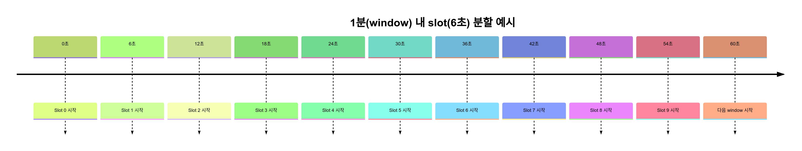

# KTC (Kona Traffic Controller) 😏

## Requirement

- `1분` 단위 최대 허용치`(Threshold)`만큼 트래픽 제한하여 대용량 트래픽 제어
    - `1분` 을 `6초` 단위로 `ceil(threshold/10)` 만큼 트래픽 진입하도록 제어 처리
    - 트래픽 대기 요청 예상 건수 : `70K` ~ `100K`
- 트래픽 대기 요청 순서를 보장하며, 대기 예상 시간 계산 & 전체 대기자 수 응답 처리

---

## Architecture

### 트래픽 제어 처리 프로세스

- 1분당 진입 허용 임계치(`threshold`) 설정 기반 트래픽 제어 처리
  - 1분 트래픽은 6초마다 `ceil(threshold/10)` 만큼 트래픽 진입 처리
- 트래픽 진입 대기 처리 시, 대기 순번 할당 & 대기 예상 시간 계산
- 트래픽 대기 순번은 고유한 `token` 식별자 진입 시점 기준으로 대기 순번 할당
- 트래픽 대기 상태 `token` 은 **반복 요청(진입 확인)** 을 통해 트래픽 진입 허용 확인

> #### 예상 시나리오
> 
> 1. 분당 `threshold`: 2000 (6초당 200 허용)
>    - 1 ~ 2000번: 즉시 입장 가능 (0분 대기)
>    - 2001 ~ 4000번: 1분 대기 후 입장
>    - 4001 ~ 6000번: 2분 대기 후 입장
> 2. `threshold` 변경: 2000 > 1000 감소 (6초당 100 허용)
>    - 6001 ~ 7000번: 3분 대기 후 입장
>    - 7001 ~ 8000번: 4분 대기 후 입장
>    - 8001 ~ 9000번: 5분 대기 후 입장
>    - 9001 ~ 10000번: 6분 대기 후 입장
> 3. `threshold` 변경 : 1000 > 500 감소 (6초당 50 허용)
>    - 10001 ~ 10500번: 7분 대기 후 입장
>    - 10501 ~ 11000번: 8분 대기 후 입장
> 4. `threshold` 변경 : 500 > 1000 증가 (6초당 100 허용)
>    - 11001 ~ 12000번: 9분 대기 후 입장

---

## Implementation

### 네트워크 통신

- **HTTP Long-Term Polling (선정)** : 일정 주기 `Client > Server` HTTP 요청하여 반복 메시지 전송 방식
- HTTP SSEs : `Client < Server` 단방향 메시지 전송 가능한 HTTP Streaming 방식 
- WebSocket : `Client <> Server` 양방향 메시지 전송 가능한 TCP Socket 방식

> **HTTP Long-Term Polling 선정 이유**
> 
> - 요구 사항을 충족하며, **긴 주기 Polling 방식은 서버 부하를 방지할 수 있는 방법** 중 하나로 판단하여 선정
> - 트래픽 대기 시, 대기 순번 기준 Client > Server Polling 주기 조절하여 부하 분산
>   - 대기 순번 `0 ~ 20_000`       : `3000ms` Polling 요청
>   - 대기 순번 `20_000 ~ 150_000` : `6000ms` Polling 요청
>   - 대기 순번 `150_000 ~`        : `9000ms` Polling 요청

### 트래픽 제어 처리

#### 트래픽 대기 순서 관리: Redis 활용

- Redis `Sorted-Set` 자료구조 활용하여 트래픽 밀리초 단위 대기 요청 시간(`score`) 기준 대기 순서 정렬
- 트래픽 대기 순서 보장 & 동시성 보장을 위해 `Lua Script` 활용한 Redis 연산 처리
- Redis Cluster 환경에서 **해시 태그(`{}`)** 사용하여 하나의 Redis 노드에 캐시 데이터 배치하도록 캐시 Key 구성

> **`Lua Script` 도입 사유**
> 
> - 트래픽 제어를 위해서는 **여러 개의 Redis 명령어 호출 및 연산 필요**
> - Redis 에 `Lua Script` 실행 요청시, 스크립트 내부 **여러 개의 명령어를 하나의 트랜잭션으로 실행하기 때문에** 원자성 보장
>   - **Redis Cluster 환경에서도** 원자성 보장 가능
>   - 동시 여러 개의 스크립트 실행 명령에도 **Redis `Single-Thread` 기반으로 동작하기 때문에** 원자성 보장 가능

#### 트래픽 대기/진입 제어: `Sliding-Window` 알고리즘

- `window` & `slot` 별로 각각 `threshold` 만큼 트래픽 진입 허용 후 나머지 요청은 대기 처리
  - `window` : `1분` 트래픽 진입 허용 단위
  - `slot` : `6초` 트래픽 진입 허용 단위
  - 1분동안 트래픽 진입 요청에 대해 `{zoneId}:window-entry-count:<현재 시간(분)>` 캐시 `threshold` 만큼 증가 처리
  - 6초동안 트래픽 진입 요청에 대해 `{zoneId}:slot-entry-count:<현재 시간(분)>:<현재 slot>` 캐시 `threshold / 10` 만큼 증가 처리
    - `<현재 시간(분)>`: 현재 시간 기준 분 추출
      - 계산 식 : `nowMillis / 60000`
      - ex) 현재 시간 : `2025/06/18 13:09:30` > `09` 분만 추출 
    - `<현재 slot>` : 현재 시간(초) 기준 slot 계산
      - 계산 식 : `(nowMillis % 60000) / 6000 / 6`
      - ex) 현재 시간 : `2025/06/18 13:09:30` > `30` 초 추출 > `30 / 6 = 5` slot 계산



#### 트래픽 제어 처리 순서

1. 트래픽 Zone 임계값(`threshold`) 조회
   - `threshold` 정보 없는 경우, `defaultThreshold` 활용
2. window & slot 계산
3. window & slot 캐시 조회
4. 대기열 Queue(`Sorted-Set`) 트래픽 진입 요청 `token` 저장
5. 진입 허용 조건 판단 및 처리
   - 진입 허용 조건
     - `widowEntryCount < threshold`
     - `slotEntryCount < allowedPer6Sec and (rank < allowedPer6Sec or waitingTime <= nowMilli)`
        - `allowedPer6Sec = ceil(threshold / 10)`
   - 진입 허용 처리
     - `windowEntryCount` 증가
     - `slotEntryCount` 증가
     - Zone 전체 `entryCount` 증가
     - 대기열 Queue 트래픽 진입 요청 `token` 제거
     - `token` 마지막 Polling 요청 시간 Cache 삭제
   - 진입 대기 처리
     - `token` 마지막 Polling 요청 시간 Cache 저장(`Sorted-Set`)
     - 대기 예상 시간 계산
     - 대기열 Queue `totalCount` 조회

> **대기 예상 시간 계산식** : `estimatedTime - totalWaitingTime`
> 
>  - `estimatedTime = rank / allowedPer6Sec * 6000`
>  - `totalWaitingTime = tokenLastPollingTime(or nowMilli) - entryMilli(score)`

---

### Project Specification

- JDK 21
- Kotlin 1.9.25
- Spring Boot 3.4.4
- Spring Data Redis Reactive (+ Lettuce)
- Redis (Amazon ElasticCache)

### Project Package Structure

```
src/main/kotlin/com/kona/ktc/
├── application/
│   └── usecase/ 
├── domain/
│   ├── event/
│   ├── model/
│   └── port/
│       ├── input/
│       └── output/
├── infrastructure/
│   ├── adapter/
│   │   └── redis/
│   ├── config/
│   └── error/
└── presentation/
    ├── adapter/
    └── dto/
        ├── mapper/
        ├── request/
        └── response/
```

---
